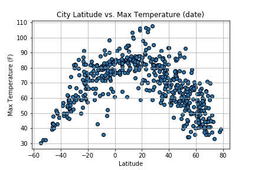
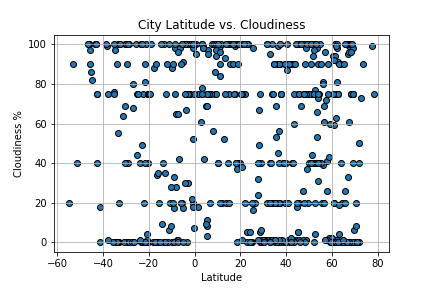
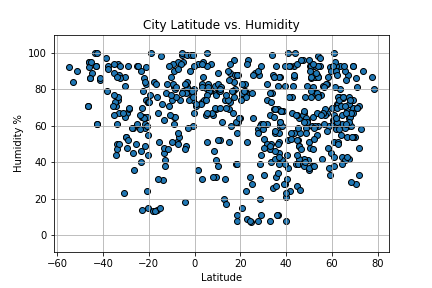
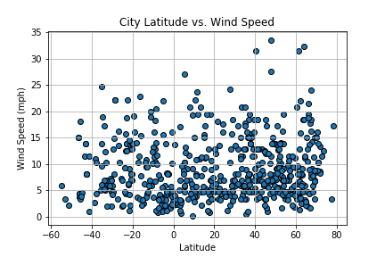

# Weather Near the Equator 

## WeatherPy

### What This Is:
The Python script utilizes the Pandas and Matplotlib libraries to visualize the weather of over 500 cities all over the world that vary in distance from the equator. The goal is to demonstrate what the weather is like near the equator. Utilized a [simple Python library](https://pypi.python.org/pypi/citipy) to randomly select over 500 cities and the [OpenWeatherMap API](https://openweathermap.org/api) to obtain climate data from all the cities.

* NOTE: Make sure to obtain and enter your OpenWeatherMap API Key in the  file.

### Scatter Plots Examining the Relationship Between:

### Data Retrieved: [Weather Data](output_data/cities.csv)

### Findings: [Finding](findings.txt)
